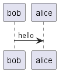

:toc: left

### <要求グループ>
****
:id: SYSRQx-xxx
====
[horizontal]
{id}:: 
    プレイヤーはテトリミノを左右90度単位で4方位に回転させる、格子単位で左右に移動させる、高速に（又は瞬時に）落下させるのいずれかまたはその複合の操作を落下中にすることができる。
理由:: 
    ここに理由を記載
説明:: 
    ここに説明を記載
*****
        <ミノの回転操作>:: 
        {id}-1::
            Rキーで、ミノを右90°回転する
        {id}-2::
            Lキーで、ミノを左90°回転する
*****
*****
        <ミノの高速落下>:: 
        {id}-3::
            ↓キーで、ミノを高速落下させる。 +
            高速落下中は、ミノは回転できないようにする。

*****
====
****